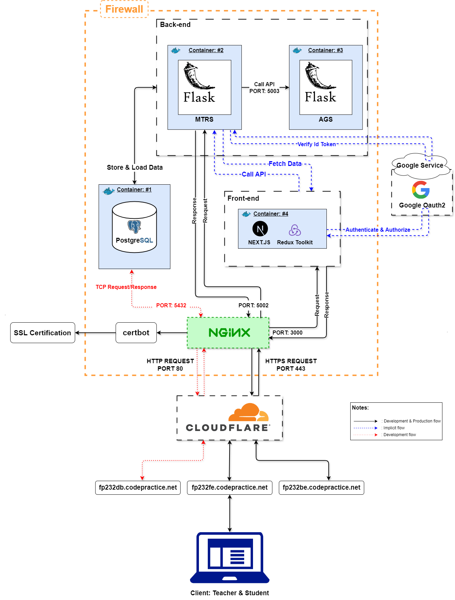
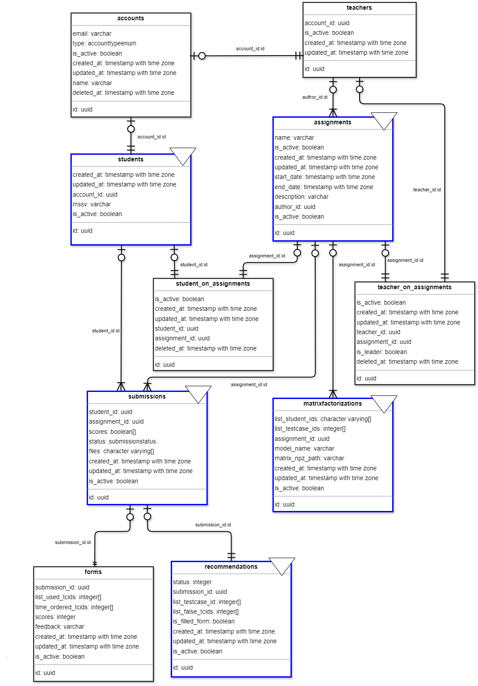

## GRADUATION THESIS - IMPROVE THE TESTCASE RECOMMENDATION SYSTEM BY INCORPORATING TIME FACTORS
- **Instructors**:
    - Ths. Vu Van Tien
    - Ths. Tran Huy
- **Authors**: 
    - Nguyen Doan Nhat Minh
    - Vu Dang Khoa
- pdf file: Bao-CaoDATN.pdf - not final file

**Source code: https://github.com/ndnhatminh/sys**
### INTRODUCTION
- **The Testcase Recommendation System (TRS)** is the Recommendation System that aims to suggest suitable testcases for students based on their performances (the ability to solve assignment in Foundation Programming, Data Structure & Algorithm).
  - **Example**: System has 1000 testcases (#1, #2...,#100), student A has only passed 500/1000 testcases. The system would only provide a small testcase set that they had failed, like: #3, #4, #5 (that the Recommendation predict they would be most likely to solve that problem successfully the next time).
- The soul model of the **TRS**, RSVD model, was used to predict the student's correct answer for each testcase. Then some testcase that have mostly ability to solve would be choose to suggest to students. 
- **This thesis** enhances the TRS by researching the time factors to 
### REQUIREMENTS

### KEY POINTS

- **SYSTEM OVERVIEW**

- **RELATIONAL DATABASE DIAGRAM**

- **PROJECT STRUCTURES**

## CONFERENCE PAPER - AN EVALUATION OF TESTCASE RECOMMENDATION SYSTEMS THROUGH FEEDBACK MODEL
- Authors: Many authors (for more detail please open this pdf file).
- pdf file: ICICCT-085_TRSReedback_Final.pdf - final file

- certificate: 51-2.pdf
